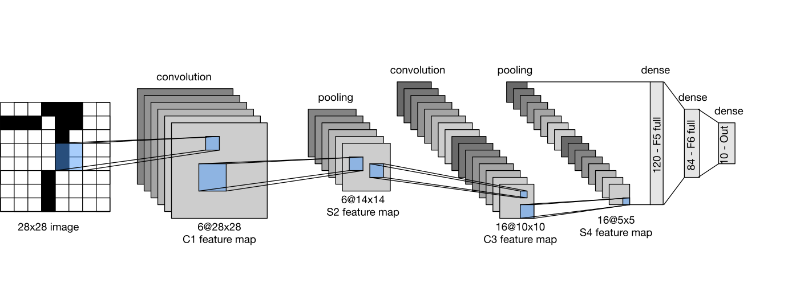

# MPC Framework Homework

## Prerequisite

- Install miniconda, see [Quick command line install - miniconda](https://docs.anaconda.com/free/miniconda/#quick-command-line-install):

  ```bash
  mkdir -p ~/miniconda3
  wget https://repo.anaconda.com/miniconda/Miniconda3-latest-Linux-x86_64.sh -O ~/miniconda3/miniconda.sh
  bash ~/miniconda3/miniconda.sh -b -u -p ~/miniconda3
  rm -rf ~/miniconda3/miniconda.sh

  export PATH=$PATH:~/miniconda3/bin
  conda --version
  ```

- prepare the python env and install python code formatter:

  ```bash
  # python3.12
  conda create --prefix ./venv python=3.12
  conda init zsh # for zsh shell
  conda activate ./venv

  pip3 install --upgrade pip
  
  # check python code format
  pip3 install pre-commit
  pre-commit install
  pre-commit run --all-files
  ```

- install python package dependencies

  ```bash
  pip3 install torch torchvision tqdm rich
  ```

## LeNet-5 Privacy Machine Learning

- Try to train LeNet-5 in local to get weights and parameters, these params will used in MPC.

  ```bash
  python3 src/lenet_torch_train.py
  ```

- Try to infer LeNet-5 in MPC enviroments, only Player-0 will load the model parameters and Player-1 will load the picture as model private input.

  ```bash
  cd src/
  bash ./run_script.py ./lenet_mpc_infer.py
  ```

## MPC Protocol

Most MPC basic blocks are from [ABY3](https://eprint.iacr.org/2018/403.pdf): A Mixed Protocol Framework for Machine Learning. As for divisions between secret and public, we use [Gold-Schmidt](https://en.wikipedia.org/wiki/Goldschmidt_division) approximation (refer to [SPU](https://github.com/secretflow/spu)).

## Experiments

### Settings

- **MPC Settings:** 
  We use a three-party scenario, with at most one corrupted (semi-honest) party. We use $Z_{2^{64}}$ as the basic ring for the computation, and use fixed-point representation with 20-bit precision. In addition, we ran 10 iterations in gold-schmidt approximation for division.

- **LeNet-5 Settings:** 
  LeNet-5 is a classic convolutional neural network architecture designed for handwritten and machine-printed character recognition. We use [MNIST datasets](https://en.wikipedia.org/wiki/MNIST_database) as the training and testing dataset for the model. The MNIST database is a large database of handwritten digits that is commonly used for training various image processing systems. The MNIST database contains 60,000 training images and 10,000 testing images.
### Design
- **LeNet-5 Architecture:** 
  
  The LeNet-5 primarily consists of seven computational units, which include the fundamental computational modules: Convolution, Average Pooling, ReLU, and Dense. The MPC operations involved in each module are shown in the table below, where 'sp' represents operations between secret and public data, 'ss' represents operations between secret data, and 'mat' represents matrix operations:

<table style="margin-left: auto; margin-right: auto;">
  <tr>
    <th>Module</th>
    <th>MPC Operations</th>
  </tr>
  <tr>
    <td>Convolution</td>
    <td><code>mul_ss</code> and <code>add_ss</code></td>
  </tr>
  <tr>
    <td>Average Pooling</td>
    <td><code>add_ss</code> and <code>div_sp</code></td>
  </tr>
  <tr>
    <td>ReLU</td>
    <td><code>max_sp</code></td>
  </tr>
  <tr>
    <td>Dense</td>
    <td><code>mat_add_ss</code> and <code>mat_mul_sp</code></td>
  </tr>
</table>


| Module          | MPC Operations         |
|-----------------|------------------------|
| Convolution     | `mul_ss` and `add_ss`  |
| Average Pooling | `add_ss` and `div_sp`  |
| ReLU            | `max_sp`               |
| Dense           | `mat_add_ss` and `mat_mul_sp` |

### Experiment Results 
We run the experiments on a single machine with 3 processes, each player equipped with one Intel(R) Xeon(R) Platinum 8358 CPU @ 2.60GHz and 1GB RAM. We assume party 0 provide the parameters and party 1 provide input image.

From the above figure, we can see that each inference costs 160.78s, with about 26.753 MB communication cost. The accuracy in plain text inference is 99.11% on this dataset. In our secure inference, we got 99.19% accuracy for the first 185 samples on this dataset. 
